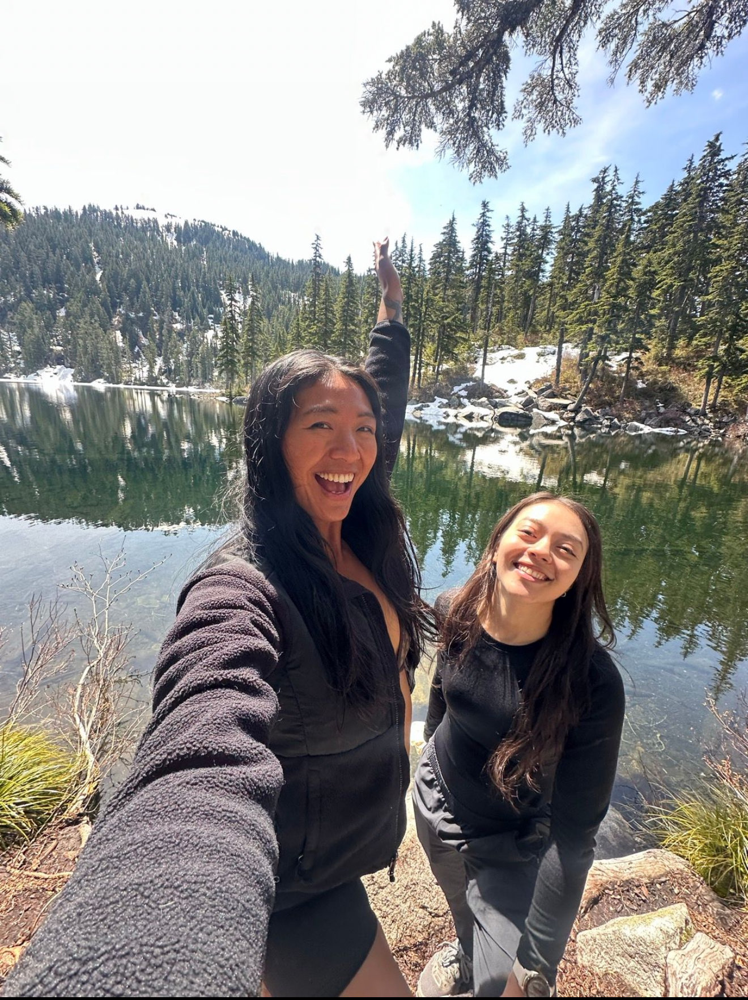
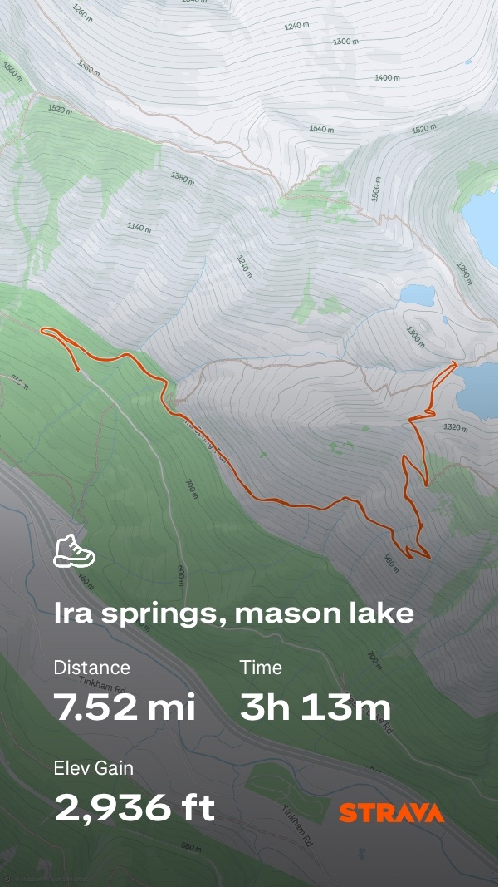
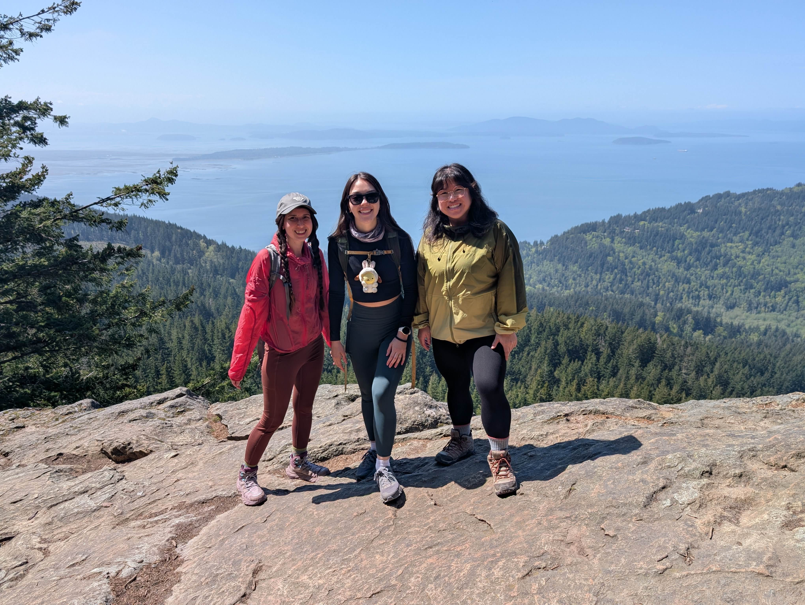
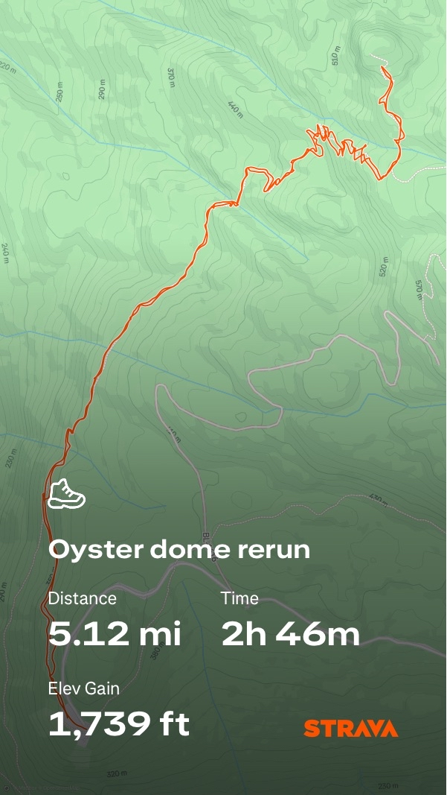

## Hikes in this post:
- [Mason Lake and Ira Springs](#mason-lake-and-ira-springs)
- [Oyster Dome](#oyster-dome)

## Mason Lake and Ira Spings
###### *May 25, 2025*
The coldest cold plunge Raiza and I have ever done!

**Note:** Cold plunging in alpine lakes can be exhilarating,
but it's important to know your limits. Sudden immersion in cold water can cause
shock or muscle cramping. Make sure you're warm beforehand, have a way to
dry off quickly, and never plunge alone. Know the signs of hypothermia, and be cautious,
especially early in the season when snowmelt is still feeding the lakes.
### Hike stats:

milage: 7.0 roundtrip
elevation gain: 2,420 feet

With the promise of a lake at the end of this hike, we set out to do one thing: plunge.

Luckily, it was a sunny day, otherwise the slight breeze and sub-70 temperature would have made us
think twice. Raiza and I hit the trail with some delicious fruit and snacks burning a hole in our packs.
We made our way up to Mason lake, stopping only briefly to admire the views of Mt. Rainier. 

As we descended toward the lake, we noticed patches of snow covering the trail.
Nothing  dangerous to traverse, but perhaps a hint that our lake was going to be chilly. 
Once we finally caught a glimpse of the lake, snow kissing the far edges, we knew we had to act fast.
Still warm from the hike in, we quickly got in before logic could speak. 

The plunge was shocking. My whole body went numb, but the sun quickly worked its magic.
We stayed at the lakeshore for about an hour, basking in the sun and enjoying our lunch.
Raiza had made a beautiful homemade strawberry mochi for us to share. 

During our entire break, only one other soul got in the water: a brave golden retriever.
Curious hikers asked if the water was cold. We could only reply with a resounding "Yes!".
Someone told us that the lake was still frozen as of last week. 

After the plunge, the mochi, and a good sun-soak, we packed up and headed back on the trail.
The effort warmed us up quickly. With our spirits totally recharged,
we were ready to plan the next adventure.

 
 

## Oyster Dome
###### *April 26, 2025*
A beautiful day for hiking and paragliding!

### Hike stats:

milage: 5.0 roundtrip
elevation gain: 1,050 feet

The three of us set out for our first hike of the season. It was a great day to stretch the legs and
get ready for a great summer. Not quite warm enough to shed the layers,
but not too cold for the soul. My kind of weather.

The trail winds through the dappled shade of the
old growth trees. At the top of the dome, we were greeted by full
sun and sweeping views of the Puget Sound. 
The trail was alive with lots of fellow hikers of all ages, their dogs in tow, and paragliders
catching the breeze at the top.

At the top, a guy hiking with his son and his friend offered everyone watermelon slices.
What a treat! I looked through my snack stash to see what I could offer in return,
but the pickings were slim. Sheepishly, I offered him back some of my nerds gummy clusters. 
It's not quite the same vibe, but every gram of sugar counts on the trail.

We headed back down the dome and made our way home where Maaz and the boys were firing up the grill.
Lunch was waiting. 
It really was the perfect day.

 
 
 
 
Back to [Projects](projects.md)

[Homepage](../index.md)