## Entries in this post:
- [Entry #1](#entry-1)
- [Entry #2](#entry-2)
- [Entry #3](#entry-3)

## Entry #3

Sketching Practice - Interlaken Update

###### Location: Interlaken Park, Seattle, WA
###### Date: April 21, 2019
###### Time: 3:00 pm
###### Temperature: 60 deg Fahrenheit
###### Notes: Partly cloudy spring day, freshly rained

Today I came back to Interlaken, better prepared to stay here for a longer period of time and to get some sketching done.

Things are looking green and beginning to bloom. The skunk cabbage has nearly doubled in size since the last time I was here about two weeks ago. Sword ferns also have new curly segments coming out of them.

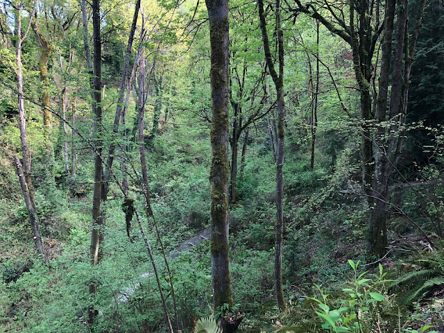

Looking down the trail right outside the Hebrew school

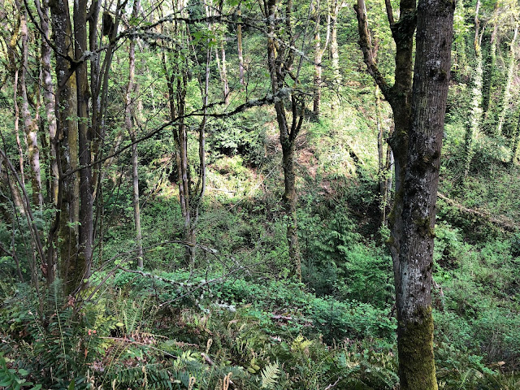

Down the trail a bit more

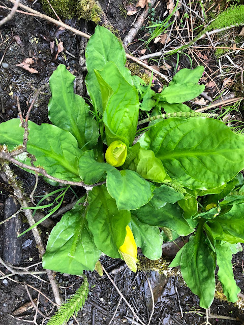

Western Skunk Cabbage - Lysichiton americanus 

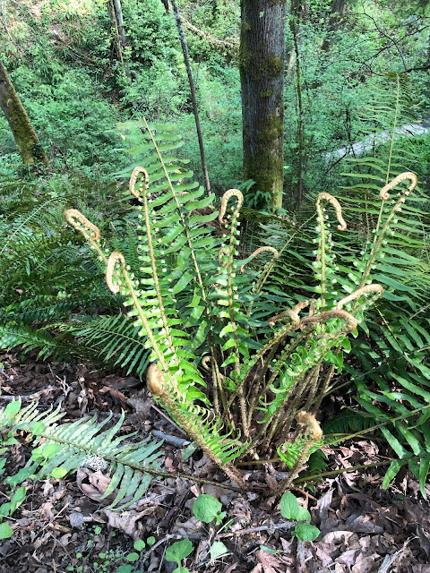

Western Sword Fern - Polystichum munitum

I heard plenty of bird calls that I am sure I will learn to identify later. After a while, several groups of people passed by me, so the sounds of birds became less frequent, with only the sound of a nearby stream babbling away and a couple of finicky crows.

I was happy to see a lot of the shrubs that we covered in class: short and tall Oregon grape, salmonberry, skunk cabbage, vine maple, sword fern, licorice fern, and bracken fern. This was a decent test of memory, and I found myself pulling out my field guide to consult more often than I had hoped. I see a lot more horsetail and whatever this is:

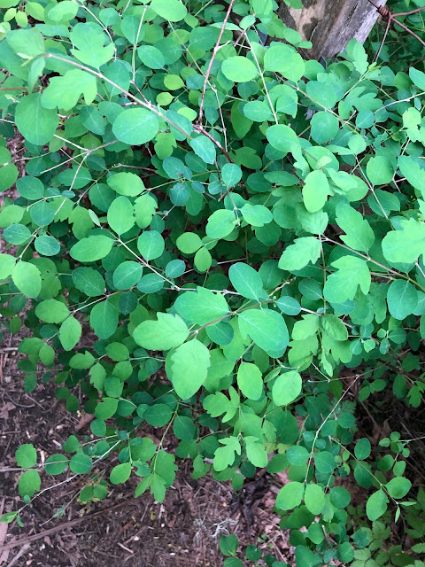

The iNaturalist auto-suggestion: snowberry. Hopefully, the kind folks over there can help ID.

I noticed that a lot of the leaves on various shrubs have small holes, possibly where a hungry insect chewed on parts of the leaf.

Little pink flowers are blooming out of the salmonberry shrubs. I'll be looking forward to seeing those berries soon. My rule of thumb before had always been to avoid red berries - so hopefully I'll get to try my first salmonberry soon this season.

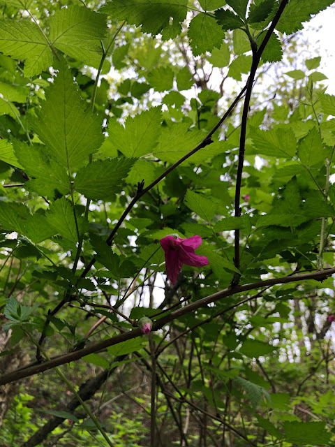

Salmonberry flower

I see a lot of maple leaves. At first, it was hard to remember which would belong to the bigleaf maple, vine maple (they are similar sizes right now), or some other maple. I sat down for a while to read up on them on the field guide. I'm getting better at identifying Douglas-fir, or perhaps this is the luck of the season. I noticed that they typically don't have many branches at eye level, so looking up at them can be unpromising. But looking below, I can almost always spot the bract-covered cones, which I believe are distinct to this tree. Later, I saw a small Douglas-fir growing, with those pointed branches sticking right out at eye level.

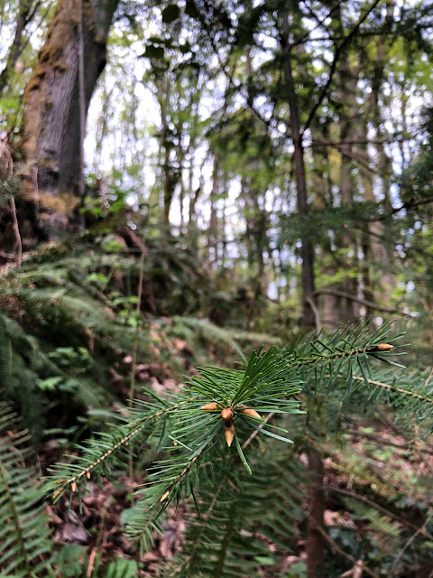

A young Douglar-fir branch

Later, I see the Western Hemlock and Western Redcedar trees, both of which are pretty distinct and have unique cones. I see a new tree, on sort of the edge of the park and closer to residential homes, which has cones unlike any that I have seen before.

New cones with interesting scales.

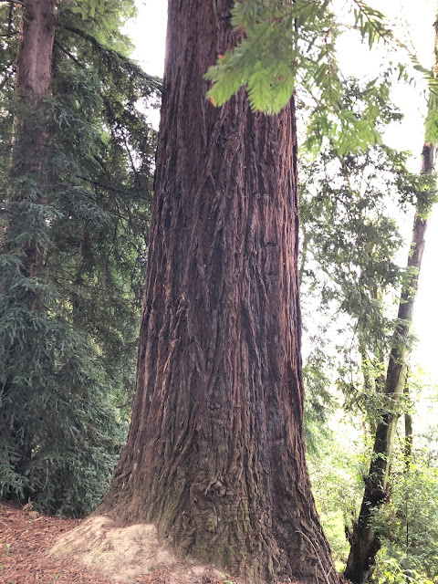

Soft bark, almost fiber-like.

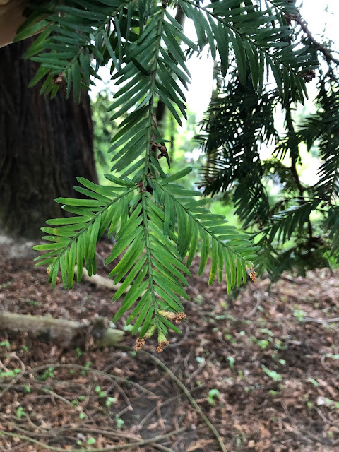

Long, flat leaves with two different shades of green.

I defer this to the folks at iNaturalist, who say that this is a Coast Redwood (Sequoia sempervirens). This is interesting in hindsight, as that tree was a decent bit larger than most of the others I saw in the park.

You, of course, can't win every game of "nice people on iNaturalist tells me what this thing is", as I later spot a spider on the underside of some Oregon grape. To keep from destroying the spider's web even more than when I first clumsily flipped this branch over, I snap just this one photo.

Unknown Spider

There aren't too many places to sit and not disturb something living as most logs I found are host to a bunch of new shrubs growing on the top of them, so I just stand by a part of the trail where the fence on the side has fallen. I chose to sketch the salmonberry leaves, partly because I have a personal interest in consuming some, and partly because they are pretty.

Exercise #3 and #4 (misnumbered here)

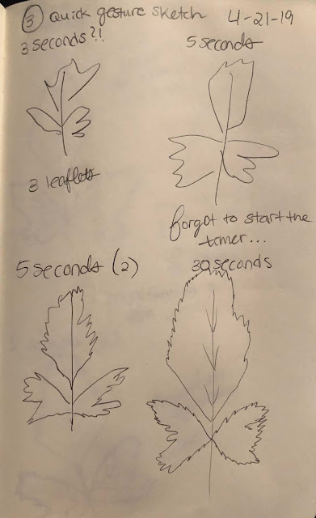

Exercise #5 Gesture Sketches (I couldn't resist attempting the 3-second sketch)

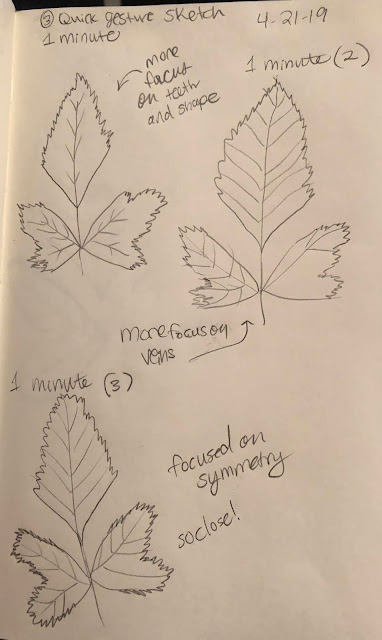

Exercise #5 part 2: 1-minute quick gesture sketches

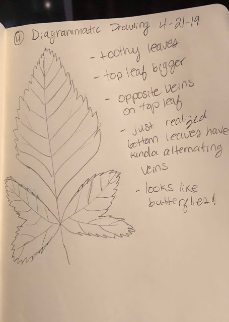

Diagrammatic sketch with more notes

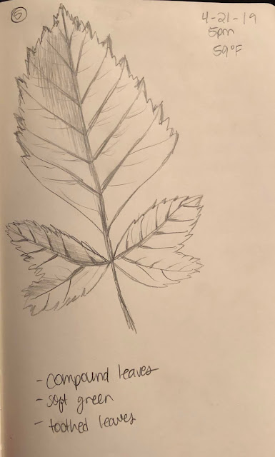

Exercise #8  - Salmonberry - Rubus spectabilis

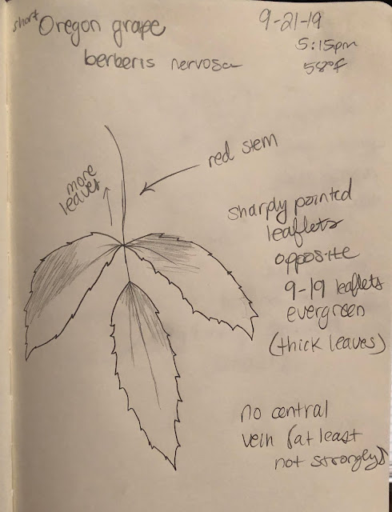

Cascade Oregon-Grape - Berberis nervosa

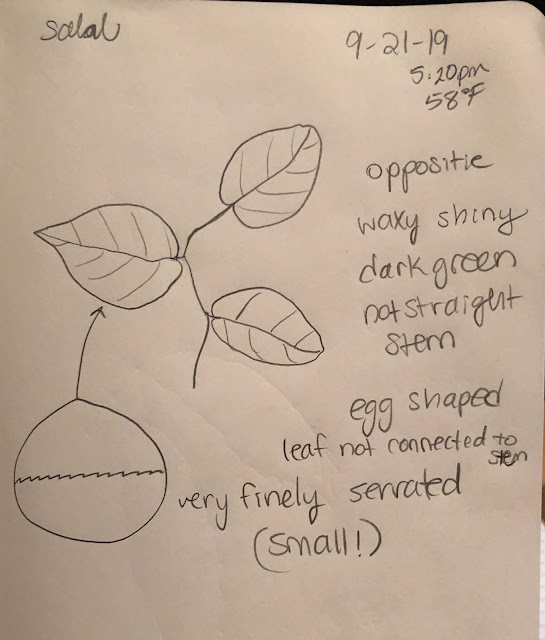

Salal  - Gaultheria shallon

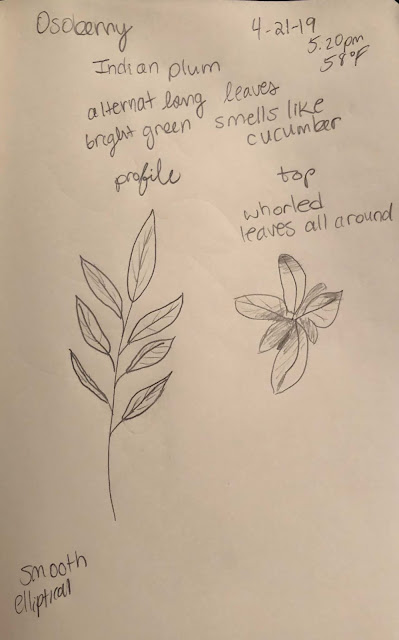

Osoberry - Oemleria cerasiformis

My series of sketches of the salmonberry, while some of them not so good, have helped me remember more easily what the leaves looked like. Sometimes trying too hard to remember a lot of new plant identifications isn't as good as just taking the time to study one and learning it really well. I think I may try this more often when trying to ID new species that I come across.

As I wrap up for the day, I watched the trees sway. I think these are bigleaf maples, so I imagine that in the next few weeks, these leaves will get much larger and change the view of the sky from down here.

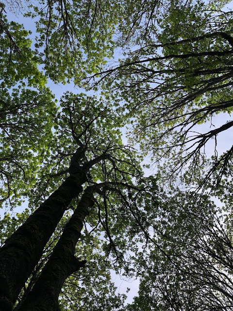

## Entry #2
On April 13-14, we traveled to the Olympic Peninsula for a weekend field trip. It's quite early in the year, so the snow has recently melted in the areas we explored. Temperatures in the 40-50 deg F range with ample rainfall made this an invigorating trip.
###### Location: Salt Creek Recreation area, Olympic Peninsula, WA
###### Date: April 13th, 2019
###### Time: 2:00 pm
###### Temperature: 50 deg Fahrenheit and sunny, then rainy and windy
For the beginning of the day, it was actually sunny and quite pleasant on the beach. Surfers were out enjoying the waters. The sound of waves crashing against the rocks is like music.

The rock here tells an ancient tale about this landmass's origin. The basalt formed from the ancient seafloor as the Juan de Fuca plate pushed against the North American plate. The boulders, made of granite, were originally carried here by the glacier that carved the Strait of Juan de Fuca.

This is truly a special place for life to evolve, as living here presents its own challenges. I noticed that everything can change here in a matter of minutes. The weather quickly turned from sunny and warm to cloudy, rainy, windy, harsh. Beyond that, anything living in the tide pools must adapt to the ever-changing tides, balancing somewhere between living exposed on the bare rocks to being battered and completely inundated with fast-moving salt water. Tidepool species are tough!

Some creatures I saw:

Pacific Blood Star - Henricia leviuscula

Pacific Purple Sea Urchin - Strongylocentrotus purpuratus

Giant Green Anemone - Anthopleura xanthogrammica

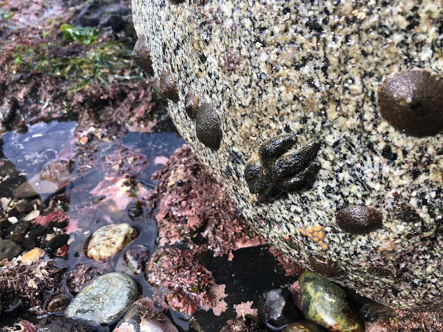

Six-rayed Star - Leptasterias hexactis

I wonder if these animals prefer certain tide pools over others. I noticed that tide pools that were higher on the rocks, a little bit further from waves, and with grass growing in them had more (or at least more visible) life. It seems that these tide pools are more sheltered from outside elements so that the daily movements have less effect. If it were me, I'd also like these shady tide pools.

Here are some sketches from the day:

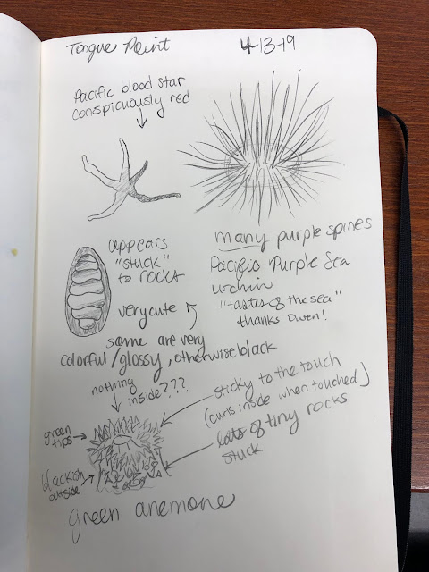

Later on, I found out that the "very cute" animal was a chiton.

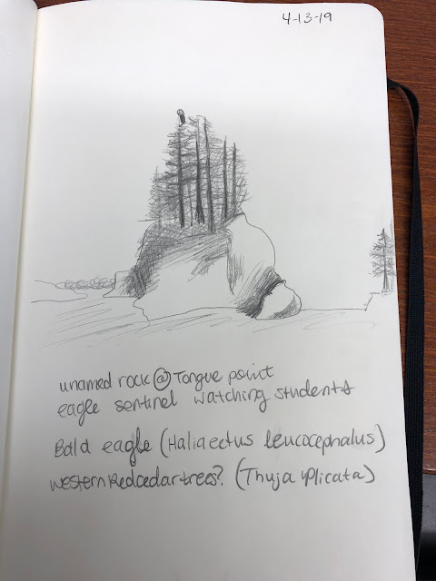

An eagle watches over us today.

I've never really tried sketching before, so I found it a little bit difficult to capture things. Since it started to rain heavily, I wasn't able to write down as many notes as I'd like. For the landscape: It reminds me of (honestly) my cat on the top of his 8-foot high perch, watching me in my apartment. I notice that the eagle is very confident in his place. He seems unbothered by all the people looking at him. I wonder if he is curious about us like we are about him. I feel relaxed, ready to take in everything.

Despite how tough these animals seem, it's always worth reflecting on how fragile the ecosystem is. As everything is dependent on the balance of predator/prey species, the collapse of one leads to the collapse of many. We learned about sea star wasting disease -- which led to the overall lack of sea stars we spotted in this area. As a result, mussel beds expanded leaving little space for other organisms. The mussels cling onto every surface we can see, which makes it impossible for anything else to latch onto a solid surface. One hypothesis is the waters are warming and contributing to the death of several species of sea star.

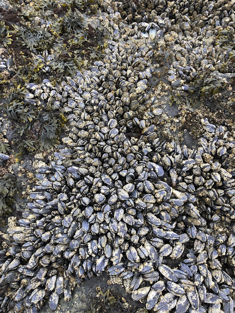

It's almost impossible to avoid mussel beds as you walk around

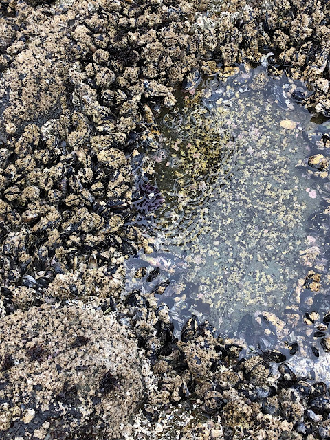

Mussels surround this tide pool

I wonder what factors are contributing to the sea star's death and if there is anything we can do to restore balance. 

### Lake Crescent - Barnes Creek
###### Location: Lake Crescent, Olympic Peninsula, WA
###### Date: April 14th, 2019
###### Time: 10:00 am
###### Temperature: 45 deg F, cloudy and rainy

Today we are headed out to a very familiar place, Lake Crescent and ultimately Marymere Falls. We begin the day with a study on the trees and plants in the forest. 

The lowland forest consists of fir, cedar, hemlock, and alder trees. The presence and size of all of these trees indicate a varied age of the forest. While it is old growth, human disturbances in the early 1900s are hinted at by the red alders thriving in certain homestead-shaped patches. This shade intolerant species is an important pioneer for disturbed soil that is not rich in nutrients. It fixes nitrogen well, producing the conditions needed for other trees to begin to thrive. Soon, red alders will give way to Douglas fir and western hemlock, which we can also see in the forests surrounding Lake Crescent. Areas with these trees must be older, as they take longer to grow than the red alder.

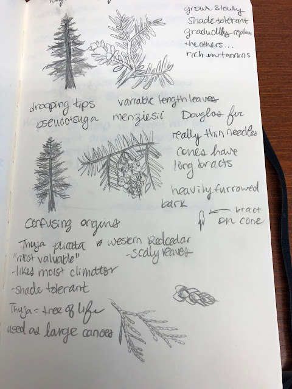

Some notes on the "top three": Douglas fir, Western hemlock, Western redcedar

After our crash course on trees, I hiked to Marymere Falls in the hopes of catching a glimpse of salamanders. I figured after yesterday's lesson in taking things slow, I should go to the falls again to catch some things I may have missed when I last came here.

Here are some of the things I found:

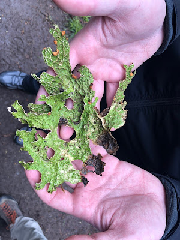

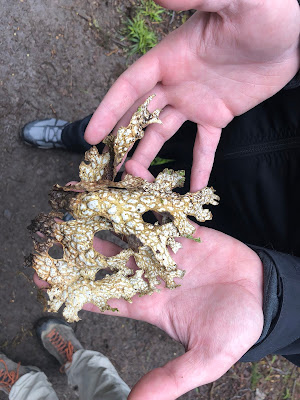

Tree Lungwort - Lobaria pulmonaria

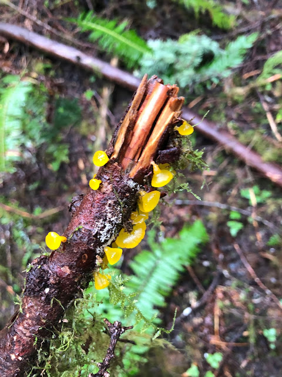

Alpine Jelly Cone - Guepiniopsis alpina

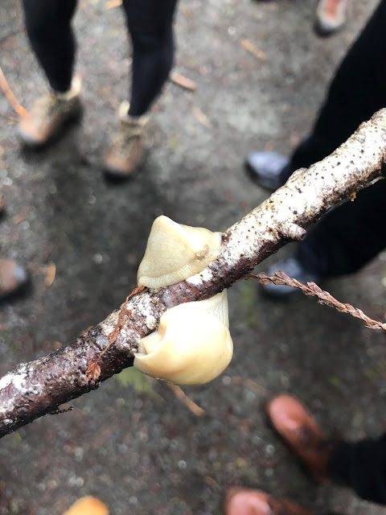

Pacific Banana Slug - Ariolimax columbianus

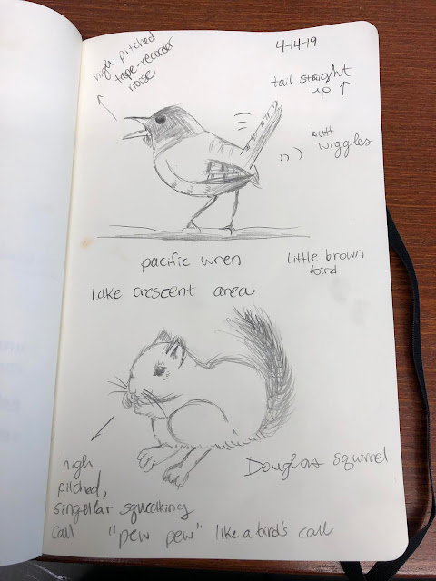

Sketches of Pacific Wren (Troglodytes pacificus) and Douglas' Squirrel (Tamiasciurus douglasii)

I forget which class reading mentions this, but after a walk here you can clearly see that even in death, organisms continue to give. Decaying matter and fallen debris from trees provide shelter for small organisms and even set up the next generation with nutrients to begin their growth. It mentions that there may even be more life in a dead tree than a live one.

Several trees growing in a line hint at a nurse log, continuing a legacy that started when that log first began its life. Moss hangs low from tree branches at every level in the forest, living as an epiphyte that benefits from its lofty position. Lichen and its algae/fungus/cyanobacteria relationship tell us that this forest is doing well. The air is good and the soil is rich. There is even a giant underground network of life in fungal mycorrhiza, living and breathing almost completely without our awareness. There are hypotheses about what this fungal mat contributes to the trees that grow alongside them. We still don't fully understand the significance and interconnectedness of the forest.

Life here is simply amazing. I feel as though I am only peering into a window and catching a glimpse of something much bigger than I can imagine. This is just a moment in time compared to the thousands of years behind all of the organisms living here. Long after I'm gone, there will hopefully be thousands more. I'm very grateful for the chance to see it now.

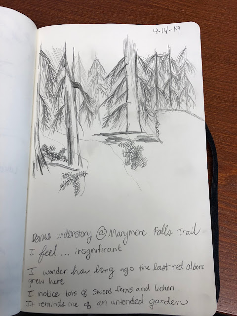

My attempt at capturing the dense forest

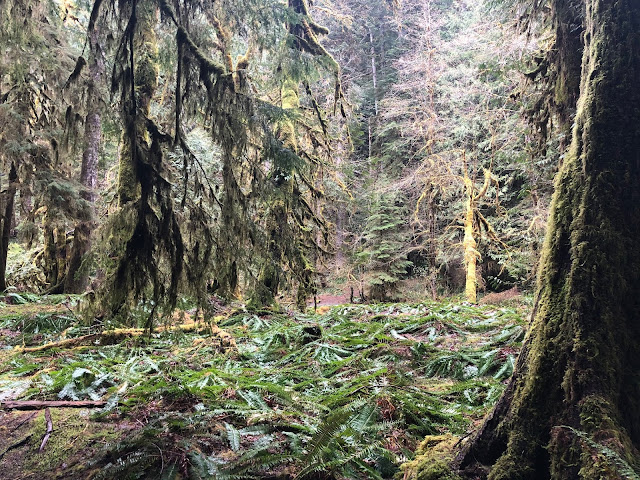

Along Barnes Creek Trail

## Entry #1

###### Location: Interlaken Park, Seattle, WA
###### Date: Sunday, April 7th, 2019
###### Time: 6:15 pm
###### Temperature: 52 deg Fahrenheit
###### Notes: Cloudy, nonzero number of motorists and other park users throughout

Some background on me:

I was never an avid adventurer. I actually have a distinct memory of my mom warning me of collecting leaves in the nearby forest in New Caney, TX, as she was afraid a deer would attack me. I was very unsuccessful in convincing her that this was not a realistic concern.

There were not a lot of opportunities to explore the outdoors before I left for college. By the time I was a freshman, I still had not gone on a single hike. That's not to say I wasn't interested; my father grew up in the Pacific Northwest and he often lamented that there were no mountains in our Houston backyard. I always thought about how much he missed it and wondered if I could also learn to love such a wild, rugged place. I daydreamed about lonely peaks and isolated days of hiking to jewel-toned lakes from the comfort of my very flat, swampy home.

When I was a junior in college, I hopped on the opportunity to go on a camping trip to Enchanted Rock with a few friends. It was the first time I walked somewhere with any elevation gain, the first time I saw an armadillo, the first time I slept outside, under the stars. I fell in love and I've been chasing that sense of wonder ever since. As beautiful as a desert sunset can be, I longed to see those snow-capped peaks that my dad talked so much about.

I moved to Seattle with the intention to explore and appreciate the mountains, the air, and the sea like my father did. Since moving here, I've had the amazing opportunity to backpack, hike, and camp in places that I couldn't even imagine less than five years ago. Since moving here, I've seen some very curious creatures (please don't tell my mother, especially about the bears), jumped in some very cold lakes, and stood on some very big rocks. It's only fair that I give back by learning about this place and using that knowledge to protect it.

I'm incredibly grateful for this place and the rich history behind its shapes, flora, fauna, and how they all interact (and how humans interact with them!). I am constantly in awe of the world around me when I am outside, but I know that my experience is lacking. The more I learn about the context and significance of this landscape, the greater my pleasure in exploring it.

For my observations, I chose Interlaken Park, mostly because of the ease of walking/biking (my main modes of transportation!) to and from the park, but also because of its interesting shape and location in the city. I regret that I lack a lot of photos as my phone died about ten minutes into my walk, so I should plan to have more foresight next time and to bring my sketching materials as a backup.

The heavy forest reminds me a lot of where I grew up in East Texas, but with more diversity and underbrush. Within seconds, I hear melodic calls from songbirds, who are amazingly good at dodging out of sight quickly. In the distance, I hear what I think is a woodpecker. I catch a glimpse of a large white bird - I think it is a heron?

Unfortunately, I had a bit of seasonal allergies, so any smells in the area went unnoticed. A classic spring season for me.

I'm overly eager to try and identify trees, quickly realizing that I still have much to learn, including how to thumb through my field guide.

I remember reading about some common tree types in Seattle, so I figured that this must be Western Redcedar, noting the fern-like leaves and rose-bud shaped cones.

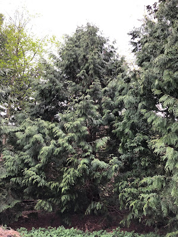

Western Redcedar - Thuja Plicata

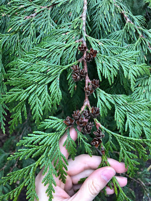

Rose-shaped cones

There are other trees along the way that I am not yet confident enough to identify, but this one happens to stand out as one of my favorites.

There are fallen logs along the way, with shelf fungus growing on logs. I'm too distracted by trees to notice too many things on the ground, but two plants stood out to me. One of them looked suspiciously like cabbage, but I was unable to get a picture. Luckily, one google search for "cabbage + Pacific + Northwest" later, I was able to identify it as skunk cabbage or Symplocarpus foetidus. The next plant that I was unable to identify is shown below.

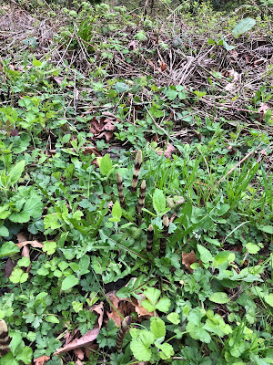

A grouplet of these plants

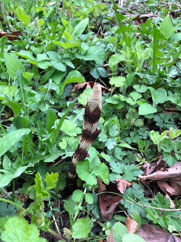

Close-up

There are some groups of these plants with a big bulb at the top and alternating dark stripes throughout the stalk.

Before my phone dies, I snapped one last pic of a tree I'd like to identify.

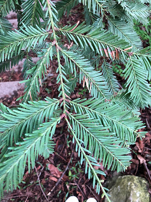

Unknown Tree

The needles reminded me of Western Hemlock, or Tsuga hetereophylla. I hesitate to call it here, not only because I can't remember anything else about the tree, but because it doesn't quite look like any pictures of western hemlock that I saw.

The name hetereophylla, meaning "differently leaved" means that the needles grow in different lengths on the same twig. Here, they appear to be roughly the same length.

As an aside, this is a really good learning moment for myself. There are probably other signs on this tree that would help me to identify it, but because I didn't grab any pictures, I can't really describe them using my words, and I especially can't remember those features at the time of typing this.

A picture is worth a thousand words!

I'll return to Interlaken soon, better prepared and hopefully a little bit more knowledgeable. My focus during this trip was admittedly narrow, so I'm hoping to capture more of this little slice of forest in Seattle.

 
 
 
 
Back to [Projects](projects.md)

[Homepage](../index.md)